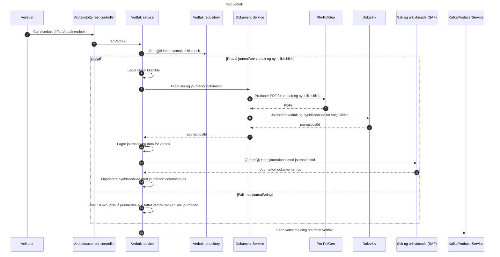
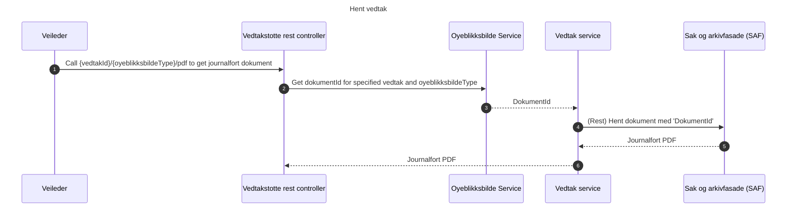

# Veilarbvedtaksstotte

Journalføring oyeblikksbilde

### Sequence of calls:

#### Fatt vedtak

```mermaid
sequenceDiagram
autonumber
title Fatt vedtak

Veileder->>Vedtakstotte rest controller: Call /{vedtakId}/fattVedtak endpoint
Vedtakstotte rest controller->>+Vedtak service: fattVedtak

Vedtak service ->> Vedtak repository: Sett gjeldende vedtak til historisk
critical Prøv å journalføre vedtak og oyeblikksbilde
Vedtak service ->>Vedtak service: Lagre Oyeblikksbilde
Vedtak service ->> Dokument Service: Produser og journalfor dokument
Dokument Service ->> Pto-PdfGen: Produser PDF for vedtak og oyeblikksbilde
Pto-PdfGen -->> Dokument Service: PDFs
Dokument Service ->>Dokarkiv: Journalfor vedtak og oyeblikksbilde for valgt kilder
Dokarkiv -->>Dokument Service: journalpostId
Dokument Service -->>Vedtak service: journalpostId
Vedtak service ->> Vedtak service: Lagre journalforing data for vedtak
Vedtak service ->> Sak og arkivfasade (SAF): (GraphQl) Hent journalpost med journalpostId
Sak og arkivfasade (SAF) -->>Vedtak service: Journalfort dokumenter ids
Vedtak service->>Vedtak service: Oppdatere  oyeblikksbilde med journalfort dokument ids
option Fail med journalføring
Vedtak service->>Vedtak service: Hver 10 min: prøv å journalføre alle fattet vedtak som er ikke journalført
end
Vedtak service ->> KafkaProducerService: Send kafka melding om fattet vedtak

```

#### Hent journalført dokumenter

```mermaid
sequenceDiagram
autonumber
title Hent vedtak

Veileder->>Vedtakstotte rest controller: Call {vedtakId}/{oyeblikksbildeType}/pdf to get journalfort dokument
Vedtakstotte rest controller ->> Oyeblikksbilde Service: Get dokumentId for specified vedtak and oyeblikksbildeType
Oyeblikksbilde Service -->>Vedtak service: DokumentId
Vedtak service ->>Sak og arkivfasade (SAF): (Rest) Hent dokument med 'DokumentId'
Sak og arkivfasade (SAF)-->>Vedtak service: Journalfort PDF
Vedtak service -->>Vedtakstotte rest controller: Journalfort PDF

```
