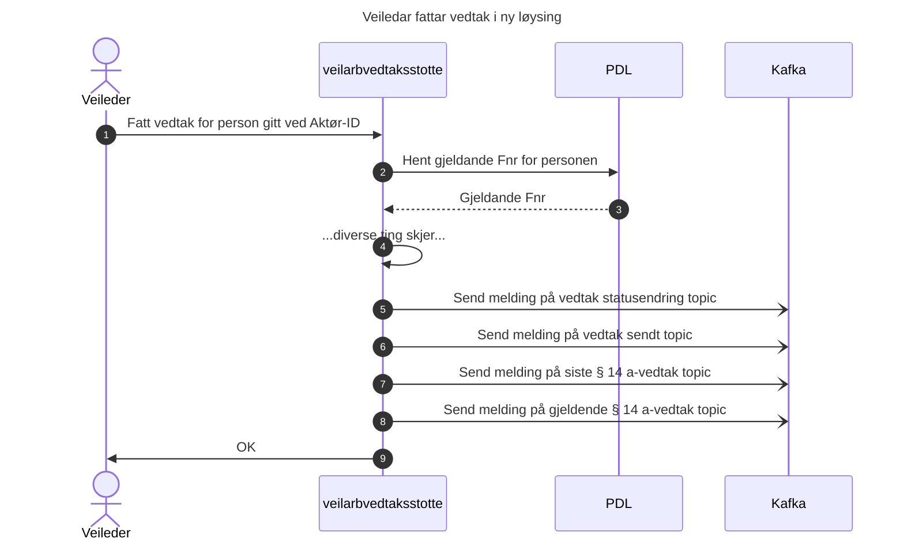
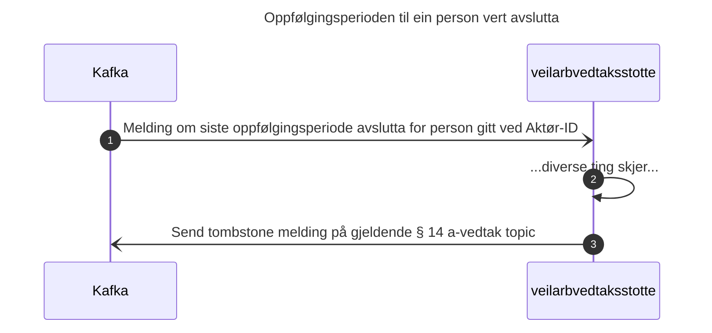
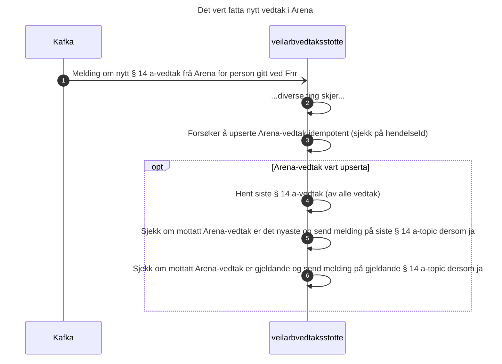
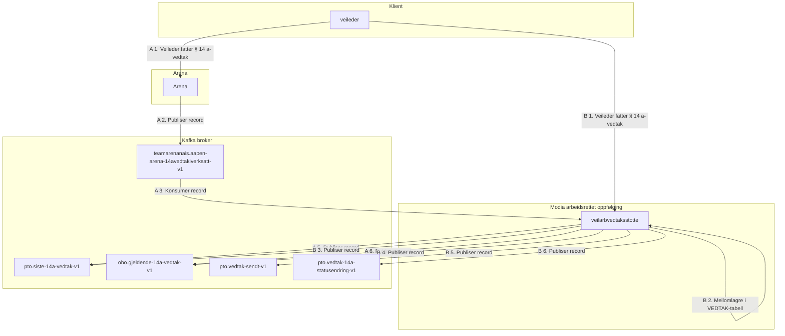
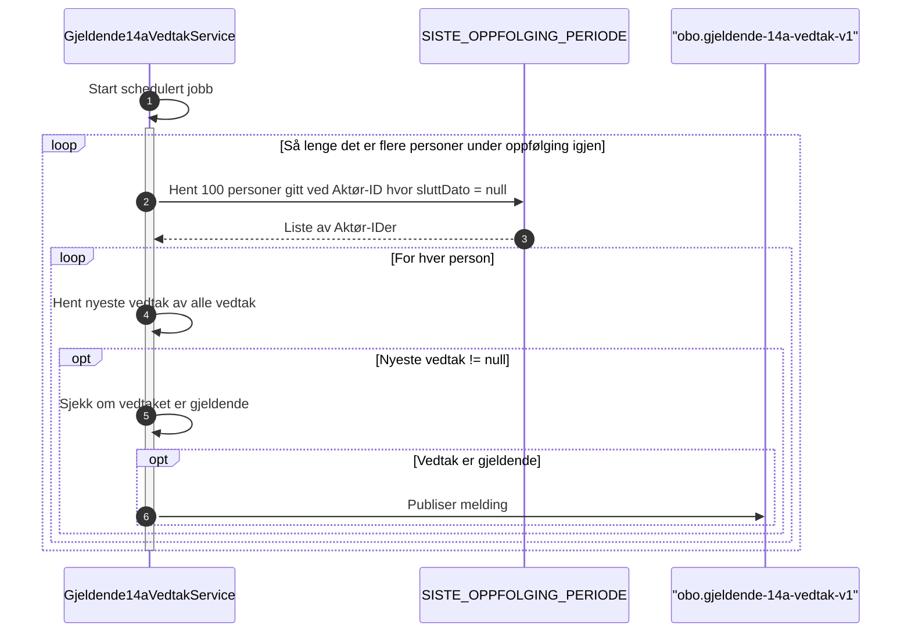

```mermaid
---
title: Veiledar fattar vedtak i ny løysing
---

%%{init: {'sequence': {'showSequenceNumbers': true}}}%%

sequenceDiagram
    actor Veileder
    participant veilarbvedtaksstotte
    participant PDL
    participant Kafka

    Veileder->>veilarbvedtaksstotte: Fatt vedtak for person gitt ved Aktør-ID
    %% Her hentar vi personen sitt gjeldande fnr frå PDL
    veilarbvedtaksstotte->>PDL: Hent gjeldande Fnr for personen
    PDL-->>veilarbvedtaksstotte: Gjeldande Fnr
    veilarbvedtaksstotte->>veilarbvedtaksstotte: ...diverse ting skjer...
    veilarbvedtaksstotte-)Kafka: Send melding på vedtak statusendring topic
    veilarbvedtaksstotte-)Kafka: Send melding på vedtak sendt topic
    veilarbvedtaksstotte-)Kafka: Send melding på siste § 14 a-vedtak topic
    veilarbvedtaksstotte-)Kafka: Send melding på gjeldende § 14 a-vedtak topic
    veilarbvedtaksstotte->>Veileder: OK
    
```

```mermaid
---
title: Oppfølgingsperioden til ein person vert avslutta
---

%%{init: {'sequence': {'showSequenceNumbers': true}}}%%

sequenceDiagram
    participant Kafka
    participant veilarbvedtaksstotte

    Kafka-)veilarbvedtaksstotte: Melding om siste oppfølgingsperiode avslutta for person gitt ved Aktør-ID
    veilarbvedtaksstotte->>veilarbvedtaksstotte: ...diverse ting skjer...
    veilarbvedtaksstotte-)Kafka: Send tombstone melding på gjeldende § 14 a-vedtak topic
```

```mermaid
---
title: Det vert fatta nytt vedtak i Arena
---

%%{init: {'sequence': {'showSequenceNumbers': true}}}%%

sequenceDiagram
    participant Kafka
    participant veilarbvedtaksstotte

    Kafka-)veilarbvedtaksstotte: Melding om nytt § 14 a-vedtak frå Arena for person gitt ved Fnr
    veilarbvedtaksstotte->>veilarbvedtaksstotte: ...diverse ting skjer...
    veilarbvedtaksstotte->>veilarbvedtaksstotte: Forsøker å upserte Arena-vedtak idempotent (sjekk på hendelseId)
    opt Arena-vedtak vart upserta
        veilarbvedtaksstotte->>veilarbvedtaksstotte: Hent siste § 14 a-vedtak (av alle vedtak)
        veilarbvedtaksstotte->>veilarbvedtaksstotte: Sjekk om mottatt Arena-vedtak er det nyaste og send melding på siste § 14 a-topic dersom ja
        veilarbvedtaksstotte->>veilarbvedtaksstotte: Sjekk om mottatt Arena-vedtak er gjeldande og send melding på gjeldande § 14 a-topic dersom ja
    end
```

```mermaid
flowchart
    veilarbvedtaksstotte[veilarbvedtaksstotte]
    arena[Arena]
    teamarenanais_aapen_arena_14avedtakiverksatt_v1[teamarenanais.aapen-arena-14avedtakiverksatt-v1]
    pto_siste_14a_vedtak_v1[pto.siste-14a-vedtak-v1]
    obo_gjeldende_14a_vedtak_v1[obo.gjeldende-14a-vedtak-v1]

    subgraph Klient
        veileder
    end

    subgraph Arena
        arena
    end

    subgraph Modia arbeidsrettet oppfølging
        veilarbvedtaksstotte
    end

    subgraph Kafka broker
        teamarenanais_aapen_arena_14avedtakiverksatt_v1
        pto_siste_14a_vedtak_v1
        obo_gjeldende_14a_vedtak_v1
        pto.vedtak-sendt-v1
        pto.vedtak-14a-statusendring-v1
    end

    veileder--A 1. Veileder fatter § 14 a-vedtak-->arena
    arena--A 2. Publiser record-->teamarenanais_aapen_arena_14avedtakiverksatt_v1
    teamarenanais_aapen_arena_14avedtakiverksatt_v1--A 3. Konsumer record-->veilarbvedtaksstotte
    veilarbvedtaksstotte--A 4. Mellomlagre i ARENA_VEDTAK-tabell-->veilarbvedtaksstotte
    veilarbvedtaksstotte--A 5. Publiser record-->pto_siste_14a_vedtak_v1
    veilarbvedtaksstotte--A 6. Publiser record-->obo_gjeldende_14a_vedtak_v1

    veileder--B 1. Veileder fatter § 14 a-vedtak-->veilarbvedtaksstotte
    veilarbvedtaksstotte--B 2. Mellomlagre i VEDTAK-tabell -->veilarbvedtaksstotte
    veilarbvedtaksstotte--B 3. Publiser record-->pto_siste_14a_vedtak_v1
    veilarbvedtaksstotte--B 4. Publiser record-->obo_gjeldende_14a_vedtak_v1
    veilarbvedtaksstotte--B 5. Publiser record-->pto.vedtak-sendt-v1
    veilarbvedtaksstotte--B 6. Publiser record-->pto.vedtak-14a-statusendring-v1
```

```mermaid
%%{init: {'sequence': {'showSequenceNumbers': true}}}%%

sequenceDiagram
    participant Gjeldende14aVedtakService
    participant SISTE_OPPFOLGING_PERIODE
    participant obo_gjeldende_14a_vedtak as "obo.gjeldende-14a-vedtak-v1"
    
    Gjeldende14aVedtakService->>Gjeldende14aVedtakService: Start schedulert jobb
    activate Gjeldende14aVedtakService
    loop Så lenge det er flere personer under oppfølging igjen
        Gjeldende14aVedtakService->>SISTE_OPPFOLGING_PERIODE: Hent 100 personer gitt ved Aktør-ID hvor sluttDato = null
        SISTE_OPPFOLGING_PERIODE-->>Gjeldende14aVedtakService: Liste av Aktør-IDer
        loop For hver person
            Gjeldende14aVedtakService->>Gjeldende14aVedtakService: Hent nyeste vedtak av alle vedtak
            
            opt Nyeste vedtak != null
                Gjeldende14aVedtakService->>Gjeldende14aVedtakService: Sjekk om vedtaket er gjeldende
                
                opt Vedtak er gjeldende
                    Gjeldende14aVedtakService->>obo_gjeldende_14a_vedtak: Publiser melding
                end
            end
        end
    end
    deactivate Gjeldende14aVedtakService
```