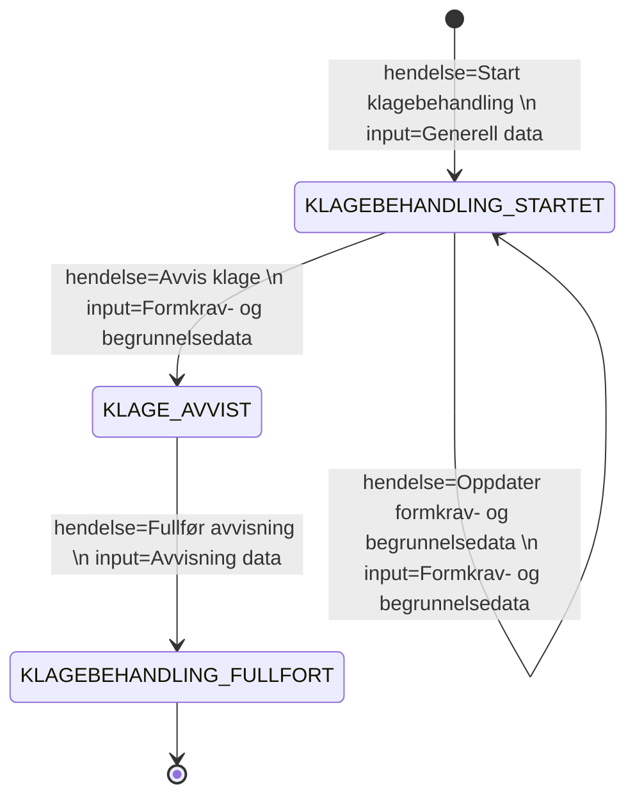

```mermaid
stateDiagram-v2
    [*]-->KLAGEBEHANDLING_STARTET: hendelse=Start klagebehandling \n input=Generell data
    KLAGEBEHANDLING_STARTET-->KLAGEBEHANDLING_STARTET: hendelse=Oppdater formkrav- og begrunnelsedata \n input=Formkrav- og begrunnelsedata
    KLAGEBEHANDLING_STARTET-->KLAGE_AVVIST: hendelse=Avvis klage \n input=Formkrav- og begrunnelsedata
    KLAGE_AVVIST-->KLAGEBEHANDLING_FULLFORT: hendelse=Fullfør avvisning \n input=Avvisning data
    KLAGEBEHANDLING_FULLFORT-->[*]
```